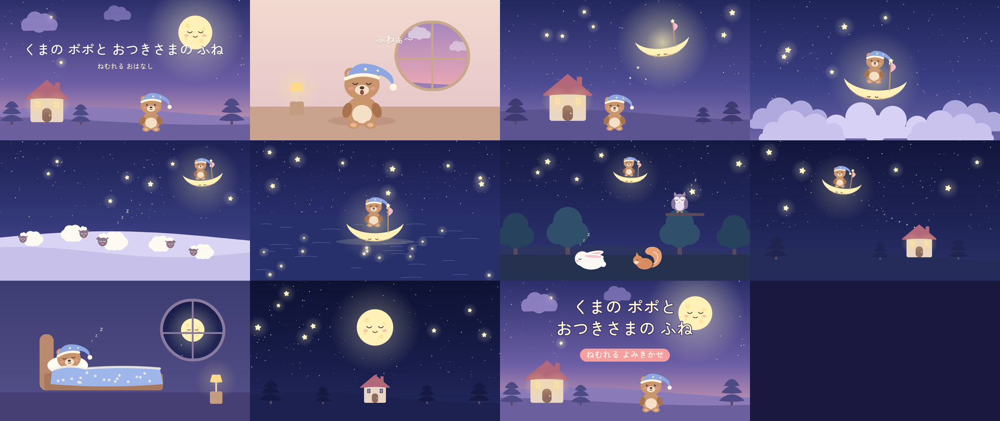

# ねむれる よみきかせ動画メーカー

3〜6さいの子ども向けの**寝かしつけ朗読動画**を、台本（YAML）から自動で作るツールです。

- 台本に書いた文章を、**ゆっくり・やさしい声**で読み上げます（音声合成）
- 場面ごとに**かわいいイラスト**を自動で描き、ゆっくりズーム・パンしながらスライドのように切り替えます
- **オリジナルの子守歌 BGM**（オルゴール風・著作権フリー）を小さく流します
- 物語が進むほど**画面がだんだん暗く**なり、最後は星空と音楽だけの時間のあと、ゆっくりフェードアウトします
- YouTube 用の **字幕ファイル（.srt）・サムネイル・概要欄のひな形** も一緒に作ります

サンプルの物語「**くまの ポポと おつきさまの ふね**」（約 6 分）が入っています。

> Canva などで手作業で動画を作る場合は、**台本＋画像生成プロンプト集** [`canva/popo_moon_boat.md`](canva/popo_moon_boat.md) を使ってください。

## 新しいおはなしの台本とスライド用プロンプトを作る（Claude Code スキル）

このリポジトリを Claude Code で開いて、次のように頼むだけで作れます。

```
/bedtime-script うさぎが主人公の、星の電車にのるおはなし。6分くらい
```

（「新しいおはなしの動画を作りたい」と普通に頼んでも、自動でこのスキルが使われます）

- 成果物は `canva/<slug>.md`（台本・キャラ設定・ポーズ集・場面ごとの英語／日本語プロンプト・Canva メモ）
- ナレーションに擬音語・擬態語（オノマトペ）が入っていないか、こわい言葉がないかを自動チェックします
- スキル本体：[`.claude/skills/bedtime-script/`](.claude/skills/bedtime-script/SKILL.md)

| 作成済みのおはなし | ファイル |
| --- | --- |
| くまの ポポと おつきさまの ふね | [`canva/popo_moon_boat.md`](canva/popo_moon_boat.md) |



## つかいかた

### 1. 準備（はじめの 1 回だけ）

Python 3.10 以上が必要です。

```bash
./scripts/setup_assets.sh
```

Python ライブラリ・丸ゴシック体フォント（Zen Maru Gothic）・女性の音声データ（tohoku-f01）を用意します。
ffmpeg は無ければ自動で同梱版（imageio-ffmpeg）を使います。

### 2. 動画を作る

```bash
# まずは確認用（720p・速い）
python -m bedtime.build stories/popo_moon_boat.yaml --preview

# 本番（1080p / 30fps）
python -m bedtime.build stories/popo_moon_boat.yaml

# 絵とサムネイルだけ確認したいとき
python -m bedtime.build stories/popo_moon_boat.yaml --stills-only
```

`build/popo_moon_boat/` に次のファイルができます。

| ファイル | 内容 |
| --- | --- |
| `popo_moon_boat.mp4` | 完成した動画 |
| `popo_moon_boat.srt` | 字幕ファイル（YouTube の「字幕」にアップロードできます） |
| `thumbnail.png` | サムネイル（1280×720） |
| `description.txt` | 概要欄のひな形（**クレジット表記入り**） |
| `stills/` | 場面ごとの絵（1920×1080） |

## 声をもっと自然にしたいとき（おすすめ：VOICEVOX）

標準の音声（Open JTalk）はパソコンの中だけで動きますが、少し機械っぽい声です。
**VOICEVOX** を使うと、ぐっと自然でやさしい声になります。

1. [VOICEVOX](https://voicevox.hiroshiba.jp/) をインストールして起動しておく（ENGINE が `http://127.0.0.1:50021` で動きます）
2. 台本の `voice:` を次のように変える

```yaml
voice:
  backend: voicevox
  speaker: 8            # 話者 ID（VOICEVOX の「設定 → キャラクター」で確認）
  speed: 0.85           # ゆっくりめ
  pitch: -0.02          # すこし低めで落ち着いた声に
  intonation: 0.9       # 抑揚をおさえると眠りやすい
  credit_name: 春日部つむぎ   # 概要欄の「VOICEVOX:○○」表記に使われます
```

> VOICEVOX はキャラクターごとに利用規約があります。YouTube で使う前に必ず確認し、概要欄にクレジット（例：`VOICEVOX:春日部つむぎ`）を入れてください。

もちろん、**ご自身の声で録音した音声**を使いたい場合も、あとから差し替えられるように作りを拡張できます（相談してください）。

## 新しいお話を作る

`stories/popo_moon_boat.yaml` をコピーして書きかえます。

```yaml
title: くまの ポポと おつきさまの ふね
scenes:
  - art: sheep_hill        # 使う絵（下の一覧）
    motion: left           # 絵の動き in / out / left / right / still
    lines:
      - text: ひつじさんが、ひとり。   # 字幕 & 読み上げる文
        pause: 2.2                     # この文のあとの「間」（秒）
      - text: ひつじさんが、ふたり。
        say: ひつじさんが、ふたり。    # 読み方を変えたいときだけ
```

使える絵（`bedtime/scenes.py`）:

| art | 場面 |
| --- | --- |
| `title` | タイトル（夕方の丘・おうち・おつきさま） |
| `yawn` | おへやで あくびをする ポポ |
| `moon_arrives` | おつきさまの ふねが むかえに来る |
| `sailing` | くもの うみを すすむ ふね |
| `sheep_hill` | ねむる ひつじの おか |
| `star_pond` | ほしの いけ |
| `sleepy_forest` | ねむりの もり（うさぎ・りす・ふくろう） |
| `going_home` | ほしの みちを とおって おうちへ |
| `in_bed` | おふとんで ねむる ポポ |
| `goodnight` | しずかな よぞらと おつきさま |

キャラクターや背景の部品（くま・ひつじ・うさぎ・りす・ふくろう・木・おうち・雲・星など）は
`bedtime/svgkit.py` にあるので、組み合わせて新しい場面を足せます。

## 眠くなる台本を書くコツ

サンプルの物語で使っている工夫です。

1. **だんだん静かに・暗く** — 夕方のお部屋 → 夜空 → 深い夜 → おふとん、と進める。画面の色も後半ほど暗くしています。
2. **くり返し** — 「みぎへ、ひだりへ」「ひつじさんが、ひとり…ふたり…」「○○さんも、おやすみ」のように同じ形の文を重ねると、子どもが先を予想できて安心します。
3. **間をだんだん長く** — 数を数える場面では `pause` を 2.2 → 2.4 → 2.6 → 2.8 秒と少しずつ延ばしています。
4. **からだを意識させる** — 「ゆっくり いきを すって、ゆっくり はいて」「てのさきも、あしのさきも、あたたかい」など、呼吸や体の温かさに注意を向ける文を入れます。
5. **ドキドキする展開を入れない** — 悪者・大きな音・びっくりする場面は使わない。
6. **ひらがな中心・分かち書き** — 読み聞かせる大人も読みやすく、音声合成の読み間違いも減ります。
7. **ナレーションにオノマトペを使わない** — 「すー」「ふー」「ぽかぽか」「ゆらゆら」などの擬音語・擬態語は避け、ふつうの言葉で言いかえます。
8. **最後は聞いている子に語りかける** — 「そして、これを きいている、あなたも。おやすみなさい。」

## YouTube に投稿するときのメモ

- **「子ども向け」設定**：アップロード時に「はい、子ども向けです」を選んでください（COPPA 対応。コメント等が自動で無効になります）。
- **クレジット**：`description.txt` の内容を概要欄に貼ってください。音声（tohoku-f01 は CC BY 4.0）やフォントの表記が入っています。
- **字幕**：動画に字幕を焼き込んでいます。焼き込みたくない場合は台本で `subtitles: false` にして、`.srt` を YouTube の字幕としてアップロードしてください。
- **長さ**：`timing.outro` を長くすると、お話のあとの「星空と音楽だけの時間」を延ばせます（例：`outro: 600` で 10 分）。

## しくみ

```
stories/*.yaml ──▶ bedtime/tts.py      朗読の音声（Open JTalk / VOICEVOX / Edge）
                ├▶ bedtime/scenes.py   場面の絵（SVG → PNG）
                ├▶ bedtime/bgm.py      子守歌 BGM を合成
                └▶ bedtime/build.py    タイミングを計算 → 場面ごとに動画化（ズーム＋字幕）
                                       → クロスフェードでつないで音と合わせる（ffmpeg）
```

## ライセンス・クレジット

- プログラム・イラスト・BGM：このリポジトリのオリジナル
- フォント：[Zen Maru Gothic](https://fonts.google.com/specimen/Zen+Maru+Gothic)（SIL Open Font License 1.1）
- 音声：[HTS voice tohoku-f01](https://github.com/icn-lab/htsvoice-tohoku-f01)（© Tohoku University, CC BY 4.0）
